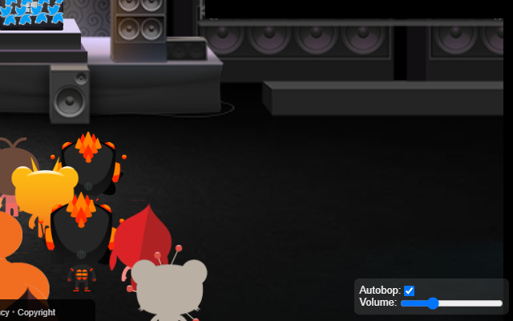

# TT Plugged In

> Turntable extension/bookmarklet that provides autobopping and volume control. among other things for now.

-

Extensions still awaiting approval in the respective stores.

For now drag install the bookmarklet here: https://nthitz.github.io/pluggedTT/index.html

Created with the mostly useful https://github.com/fregante/browser-extension-template Thanks for that!

Local development:

    npm install
    npm run build

